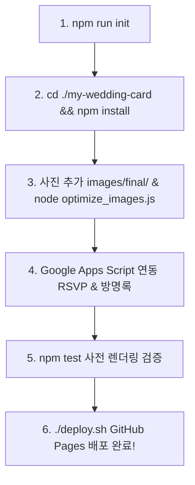

# 💍 Mobile Wedding Card Skill (모바일 청첩장 템플릿 & 에이전트 스킬)

> **AI 코딩 에이전트와 개발자를 위한 모바일 청첩장 제작 템플릿 & 대화형 CLI 스킬**  
> *Craft production-ready, beautiful, and accessible mobile wedding invitations in minutes.*

<div align="center">

[](https://unoshin.github.io/wedding-card/)
[](https://opensource.org/licenses/MIT)
[](https://nodejs.org/)
[]()

</div>

---

## 🌸 테마 미리보기 (Design Themes)

청첩장 디자인은 `css/variables.css`의 토큰 시스템으로 제어되며, 위저드에서 클릭 한 번으로 변경할 수 있습니다.

| 테마명 | 주요 컬러 팔레트 | 분위기 & 추천 예식 |
| :--- | :--- | :--- |
| **Romantic Rose** *(Default)* | `■ #d099a1` (Rose Pink) &nbsp; `■ #faf2f3` (Blush) &nbsp; `■ #f8f5f3` (Beige) | 따뜻하고 화사한 하우스/가든 웨딩 & 클래식 웨딩 |
| **Classic Elegance** | `■ #c5a059` (Champagne Gold) &nbsp; `■ #1d3557` (Deep Navy) &nbsp; `■ #f3f5f7` (Cool Grey) | 품격 있고 차분한 호텔 웨딩 & 컨벤션 웨딩 |
| **Modern Pure** | `■ #333333` (Charcoal) &nbsp; `■ #f0f0f0` (Light Gray) &nbsp; `■ #ffffff` (Pure White) | 세련되고 감각적인 흑백 스튜디오 사진 & 미니멀 웨딩 |

---

## ✨ 핵심 기능 (Key Highlights)

- ⚡ **Zero-Build & Pure Vanilla**: 리액트/뷰 등 무거운 빌드 과정 없이 순수 HTML/CSS/JS로 초경량 로딩 & 모바일 Safari/Chrome/인앱 브라우저 100% 호환
- 💬 **대화형 커스터마이징 (Interactive Wizard)**: `npm run init` 실행 시 터미널에서 신랑/신부 정보, 예식 일정, 계좌번호, 컬러 테마, 꽃잎 효과를 대화형으로 완성
- 🌸 **꽃잎 흩날림 애니메이션 (`petals.js`)**: 터치 및 스크롤을 전혀 방해하지 않는 고성능 벚꽃/꽃잎 흩날림 오버레이 (`prefers-reduced-motion` 웹 접근성 지원)
- 📅 **인터랙티브 캘린더 & D-Day 실시간 카운트다운**: 예식일 자동 마킹 및 초단위 카운트다운
- 🖼️ **터치 스와이프 지원 라이트박스 갤러리**: 모바일 터치 제스처로 자연스럽게 넘겨보는 고화질 갤러리 모달
- 📊 **서버리스 RSVP & 방명록**: Google Sheets + Google Apps Script를 활용한 무료/영구 백엔드 (비밀번호 기반 글 삭제 지원)
- 🗺️ **지도 & 교통편 연동**: 반응형 지도 임베드, 카카오맵/네이버지도 바로가기 링크, 주소 복사
- 💳 **축의금 계좌번호 복사 & 아코디언**: 신랑측/신부측 접이식 계좌 목록 및 원클릭 복사
- 🖼️ **고화질 사진 자동 압축 (`optimize_images.js`)**: Sharp 라이브러리로 수십 MB의 원본 사진을 100~200KB 대의 초경량 웹 이미지로 최적화
- 🛡️ **사전 렌더링 품질 보증 (`test_render_jsdom.js`)**: JSDOM을 통한 자동 검증으로 배포 시 백화 현상 및 JS 런타임 오류 원천 차단
- 🚀 **원클릭 배포 (`deploy.sh`)**: 자동 검증 통과 후 GitHub Pages로 안전 배포

---

## 🚀 빠른 시작 (Quick Start)

### 1. 대화형 위저드로 새 청첩장 만들기 (Interactive CLI)

```bash
# 저장소 복제
git clone https://github.com/unoShin/mobile-wedding-card-skill.git
cd mobile-wedding-card-skill

# 대화형 생성 마법사 실행 (대상 폴더 지정)
npm run init ./my-wedding-card
```

터미널의 질문에 따라 신랑/신부 이름, 예식 일시, 장소, 계좌번호, 테마를 입력하면 맞춤형 청첩장 프로젝트가 즉시 생성됩니다!

```text
=====================================================
  💍 모바일 청첩장 맞춤 제작 위저드 (Mobile Wedding Card)
=====================================================
엔터(Enter)를 누르면 [기본값]이 자동으로 적용됩니다.

📁 생성할 프로젝트 경로 [./my-wedding-card]: 
--- 🤵 신랑 정보 ---
신랑 성 [신]: 
신랑 이름 [윤호]: 
신랑 연락처 [010-1234-5678]: 
...
```

> [!TIP]
> 모든 질문에 엔터(Enter)를 누르면 완성도 높은 기본 샘플 데이터가 적용되어 즉시 테스트해볼 수 있습니다.

---

## 🤖 AI 에이전트에서 스킬로 사용하기 (For AI Agents)

이 저장소는 **Antigravity, Cursor, Claude Code, Windsurf, Roo Code, Copilot** 등 모든 AI 코딩 에이전트 표준을 지원합니다.

### 1. Antigravity / Gemini CLI 전역 스킬 등록
스킬 폴더를 전역 스킬 디렉토리에 복사하면 모든 작업 공간에서 에이전트가 스킬을 자동 인식합니다.

```bash
mkdir -p ~/.gemini/config/skills
cp -r . ~/.gemini/config/skills/mobile-wedding-card
```

### 2. Cursor / Claude Code / Windsurf
프로젝트에 포함된 [`AGENTS.md`](./AGENTS.md), [`CLAUDE.md`](./CLAUDE.md), [`SKILL.md`](./SKILL.md) 지침에 따라 에이전트가 사용자에게 필요한 청첩장 정보를 질의한 뒤 맞춤형 코드를 생성합니다.

> **에이전트에게 이렇게 말해보세요:**
> - *"우리 결혼식 모바일 청첩장 하나 만들어줘."*
> - *"2027년 5월 16일 예식 일정으로 청첩장 프로젝트 초기화해줘."*

---

## 📁 프로젝트 구조 (Directory Structure)

```text
mobile-wedding-card-skill/
├── SKILL.md                          # 에이전트 공통 스킬 규격 파일
├── AGENTS.md                         # 범용 AI 에이전트 지침
├── CLAUDE.md                         # Claude Code 설정
├── GEMINI.md                         # Antigravity/Gemini 설정
├── bin/                              # CLI 실행 바이너리
├── scripts/
│   ├── init.js                       # 대화형 프로젝트 생성 CLI
│   └── scaffold.js                   # 기본 템플릿 복제 스크립트
├── templates/                        # 청첩장 웹 템플릿
│   ├── data/config.json              # 데이터 중앙 관리 파일
│   ├── css/                          # 분리형 CSS 스타일시트
│   ├── js/app.js                     # 청첩장 코어 스크립트
│   ├── js/petals.js                  # 꽃잎 흩날림 애니메이션
│   ├── google_apps_script.js         # Google Apps Script 백엔드 코드
│   ├── optimize_images.js            # Sharp 이미지 경량화 도구
│   ├── test_render_jsdom.js          # JSDOM 사전 검증 테스트
│   ├── deploy.sh                     # 배포 스크립트
│   └── index.html                    # 메인 단일 페이지
└── references/
    ├── backend-setup.md              # Google Apps Script 백엔드 연동 가이드
    ├── customization-guide.md        # 디자인/테마/컴포넌트 커스텀 가이드
    └── troubleshooting.md            # 모바일 웹뷰 대응 및 트러블슈팅
```

---

## 📋 제작 및 배포 워크플로우 (Production Workflow)



1. **프로젝트 초기화**: `npm run init ./my-wedding-card`
2. **의존성 설치**: `cd ./my-wedding-card && npm install`
3. **사진 추가 및 최적화**:
   - `images/final/` 폴더에 웨딩 사진(`new_main.jpg`, `01.jpg` ~ `15.jpg`) 넣기
   - `node optimize_images.js` 실행 (고화질 사진 자동 압축)
4. **구글 시트 백엔드 연동**:
   - [Google Apps Script 백엔드 연동 가이드](./references/backend-setup.md)를 참조하여 RSVP 및 방명록 URL을 `data/config.json`에 입력
5. **품질 검증 테스트**:
   - `npm test` (JSDOM 기반 백화 현상 및 런타임 오류 자동 검증)
6. **GitHub Pages 배포**:
   - `./deploy.sh` 실행

---

## 📚 상세 레퍼런스 가이드

- [📖 구글 시트 & Apps Script 백엔드 연동 가이드](./references/backend-setup.md)
- [🎨 디자인 테마, 폰트 및 애니메이션 커스텀 가이드](./references/customization-guide.md)
- [🛠️ 모바일 웹뷰 호환성 & 트러블슈팅](./references/troubleshooting.md)

---

## 📄 라이선스 (License)

이 프로젝트는 [MIT License](./LICENSE)를 따릅니다. 누구나 자유롭게 수정하고 나만의 모바일 청첩장을 제작할 수 있습니다.
