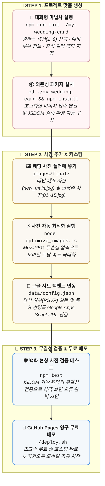

# 💍 Mobile Wedding Card Skill (예비 신혼부부를 위한 모바일 청첩장 템플릿)

> **소중한 첫걸음을 준비하는 예비 신혼부부를 위한 모바일 청첩장 셀프 제작 템플릿 & AI 에이전트 스킬**  
> *Craft your dream wedding invitation in minutes — no coding background required.*

<div align="center">

[](https://unoshin.github.io/wedding-card/)
[](https://opensource.org/licenses/MIT)
[]()

</div>

---

## 🌸 실제 동작 예시 (Live Demo)

실제로 제작하고 배포된 **샘플 모바일 청첩장**을 직접 확인해보세요!

👉 **[https://unoshin.github.io/wedding-card/](https://unoshin.github.io/wedding-card/)**

- 🌸 은은하게 흩날리는 벚꽃/꽃잎 애니메이션
- 📅 2027년 1월 예식일 달력 자동 마킹 & 실시간 D-Day 타이머
- 🖼️ 손가락으로 가볍게 넘겨보는(터치 스와이프) 고화질 웨딩 갤러리
- 🗺️ 오시는 길 (여의도 웨딩컨벤션) 지도 및 대중교통 안내
- 💳 신랑측/신부측 축의금 계좌번호 복사 아코디언
- 💌 구글 스프레드시트로 실시간 접수되는 참석 여부(RSVP) 및 축하 방명록

---

## 🧩 내 마음에 쏙 드는 구성만 쏙쏙! (맞춤형 섹션 조합)

모든 예비부부의 예식 스타일과 선호는 다릅니다.  
`npm run init` 실행 시 **필요한 섹션만 자유롭게 선택(Checkbox 방식)**하여 나만의 청첩장을 만들 수 있습니다:

| 번호 | 구성 섹션 (Components) | 설명 | 선택 여부 |
| :---: | :--- | :--- | :---: |
| **[1]** | **📅 캘린더 & D-Day 실시간 카운트다운** | 예식일 달력 마킹 및 남은 시간(초단위) 타이머 | 선택 가능 |
| **[2]** | **🖼️ 사진 갤러리 & 라이트박스** | 모바일 터치 스와이프 지원 고화질 사진첩 | 선택 가능 |
| **[3]** | **🗺️ 오시는 길 & 지도/교통편 안내** | 구글 맵 임베드, 카카오/네이버지도 링크, 주소 복사 | 선택 가능 |
| **[4]** | **💳 마음 전하실 곳 (축의금 계좌)** | 신랑측/신부측 계좌번호 접이식 아코디언 & 복사 | 선택 가능 |
| **[5]** | **💌 참석 여부 전달 (RSVP 설문)** | 동반 인원, 식사 여부를 구글 시트로 실시간 수집 | 선택 가능 |
| **[6]** | **💬 축하 한마디 방명록 게시판** | 하객들의 축하 메시지 등록 및 비밀번호 기반 삭제 | 선택 가능 |
| **[7]** | **🔗 청첩장 공유하기** | 카카오톡 공유 메시지 및 URL 링크 복사 | 선택 가능 |
| **[8]** | **🌸 꽃잎 흩날림 애니메이션 효과** | 화면 위에 화이트/핑크 꽃잎이 떨어지는 시각 효과 | 선택 가능 |
| **[9]** | **🎵 배경음악(BGM) 오디오 플레이어** | 모바일 자동재생 정책 대응 은은한 배경음악 토글 | 선택 가능 |

---

## 🎨 감성적인 디자인 테마 (Design Themes)

원하시는 분위기에 맞춰 3가지 디자인 테마 중 하나를 선택할 수 있습니다:

| 테마명 | 주요 컬러 팔레트 | 분위기 & 추천 예식 |
| :--- | :--- | :--- |
| **Romantic Rose** *(기본)* | `■ #d099a1` (로즈 핑크) &nbsp; `■ #faf2f3` (블러쉬) &nbsp; `■ #f8f5f3` (베이지) | 따뜻하고 사랑스러운 하우스/가든 & 클래식 웨딩 |
| **Classic Elegance** | `■ #c5a059` (샴페인 골드) &nbsp; `■ #1d3557` (딥 네이비) &nbsp; `■ #f3f5f7` (그레이) | 품격 있고 차분한 호텔 웨딩 & 컨벤션 웨딩 |
| **Modern Pure** | `■ #333333` (차콜) &nbsp; `■ #f0f0f0` (라이트 그레이) &nbsp; `■ #ffffff` (화이트) | 세련되고 감각적인 흑백 스튜디오 사진 & 미니멀 웨딩 |

---

## 🚀 빠른 시작 (Quick Start)

### 1. 대화형 위저드로 1분 만에 청첩장 만들기

```bash
# 저장소 복제
git clone https://github.com/unoShin/mobile-wedding-card-skill.git
cd mobile-wedding-card-skill

# 대화형 생성 마법사 실행 (대상 폴더 지정)
npm run init ./my-wedding-card
```

터미널에서 안내하는 질문에 따라 **포함할 섹션 번호, 신랑/신부 성함, 예식 일정, 장소, 계좌번호, 테마**를 입력하면 맞춤형 청첩장 프로젝트가 즉시 생성됩니다!

```text
======================================================================
  💍 예비 신혼부부를 위한 모바일 청첩장 제작 위저드 (Mobile Wedding Card)
======================================================================
엔터(Enter)를 누르면 [기본값]이 자동으로 적용됩니다.

📁 생성할 프로젝트 경로 [./my-wedding-card]: 

--- 🧩 청첩장에 포함할 구성요소(섹션)를 선택해 주세요 ---
  [1] 📅 캘린더 & D-Day 실시간 카운트다운 (Calendar & Countdown)
  [2] 🖼️ 사진 갤러리 & 풀스크린 라이트박스 (Photo Gallery)
  [3] 🗺️ 오시는 길 & 지도/대중교통 안내 (Location & Map)
  [4] 💳 마음 전하실 곳 (신랑/신부 축의금 계좌번호 아코디언)
  [5] 💌 참석 여부 전달 (RSVP 팝업 설문)
  [6] 💬 축하 한마디 방명록 게시판 (Guestbook)
  [7] 🔗 청첩장 공유하기 (카카오톡/링크 복사)
  [8] 🌸 벚꽃/꽃잎 흩날림 애니메이션 효과 (Falling Petals)
  [9] 🎵 배경음악(BGM) 오디오 플레이어 (Background Audio)

포함할 섹션 번호 입력 (쉼표 구분, 엔터 누르면 전체 선택) [1,2,3,4,5,6,7,8,9]: 
```

> [!TIP]
> 엔터(Enter)를 누르면 완성도 높은 기본 샘플 데이터가 적용되어 즉시 결과를 눈으로 확인해볼 수 있습니다.

---

## 🤖 AI 에이전트와 함께 만들기 (For AI Pair Programming)

Antigravity, Cursor, Claude Code, Windsurf 등 AI 코딩 비서에게 청첩장 제작을 부탁해보세요!

> **에이전트에게 이렇게 말씀해 보세요:**
> - *"우리 결혼식 모바일 청첩장 만들고 싶어. 캘린더랑 갤러리, 계좌번호, 지도만 넣어서 심플하게 구성해줘."*
> - *"2027년 5월 16일 오후 2시 아펠가모 선릉 예식으로 로맨틱 로즈 테마 청첩장 만들어줘."*

---

## 📋 제작 및 배포 워크플로우 (Production Workflow)



<br/>

| 단계 | 주요 작업 | 명령어 & 세부 설명 |
| :--- | :--- | :--- |
| **1. 프로젝트 초기화** | 대화형 질문으로 나만의 청첩장 생성 | `npm run init ./my-wedding-card`<br/>• 원하는 섹션(1~9), 부부 성함, 예식 일정, 테마 컬러 선택 |
| **2. 패키지 설치** | 필수 도구 환경 구성 | `cd ./my-wedding-card && npm install`<br/>• sharp 이미지 최적화 도구 및 JSDOM 검증 라이브러리 설치 |
| **3. 사진 추가 & 압축** | 고화질 사진을 웹에 최적화 | `node optimize_images.js`<br/>• `images/final/`에 사진 넣고 실행 시 초고화질 무손실 압축 자동 수행 |
| **4. 백엔드 연동** | 참석 여부 및 방명록 구글 시트 연결 | `data/config.json`<br/>• [Google Apps Script 백엔드 연동 가이드](./references/backend-setup.md) 참조 URL 입력 |
| **5. 품질 무결성 검증** | 배포 전 백화 현상 & 오류 자동 점검 | `npm test`<br/>• DOM 요소 누락, 스크립트 에러, 데이터 불일치 사전 차단 |
| **6. 무료 호스팅 배포** | 전 세계 누구나 접속 가능한 웹사이트 배포 | `./deploy.sh`<br/>• GitHub Pages를 통해 클릭 한 번으로 평생 무료 배포 완료 |

---

## 📚 상세 레퍼런스 가이드

- [📖 구글 시트 & Apps Script 백엔드 연동 가이드](./references/backend-setup.md)
- [🎨 디자인 테마, 폰트 및 애니메이션 커스텀 가이드](./references/customization-guide.md)
- [🛠️ 모바일 웹뷰 호환성 & 트러블슈팅](./references/troubleshooting.md)

---

## 📄 라이선스 (License)

이 프로젝트는 [MIT License](./LICENSE)를 따릅니다.  
소중한 결혼식을 준비하시는 모든 예비 신혼부부님들의 행복한 시작을 응원합니다. 💐
